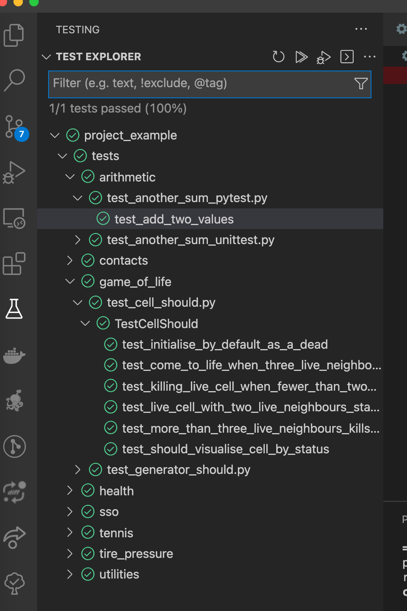

# Introduction

Create simple unit testing sample and understand good naming and generation of samples ...

The inspiration for this is taken from this article https://testdriven.io/blog/modern-tdd/

# Setup

### Using poetry (latest and greatest)

1. Detailed information can be found at https://python-poetry.org/docs/

2. Install`curl -sSL https://raw.githubusercontent.com/python-poetry/poetry/master/get-poetry.py | python -`

3. Alternative install can be done through **pip** `pip install --user poetry` or **pipx** `pipx install poetry`

4. Once installed this will allow you to check the version installed running `poetry --version`

5. Update poetry `poetry self update`

6. [Basic usage](https://python-poetry.org/docs/basic-usage/) of setting up a project can be done 

   ```bash
   cd pre-existing-project
   poetry init
   ```

7. To install all dependencies `poetry install`

8. To understand what poetry does use `poetry -h`

9. To run tests outside of vscode test runner `poetry run pytest` but configure the vscode test explorer for better results

   

### Using a virtual environment

1. Setup the version of python to work with:

   ```bash
   python3.10 -m venv env
   source env/bin/activate
   pip install -U pip
   ```

1. Install dependencies `pip install -r requirements.txt`

### Using the library path (beginner stuff really)

1. Install `pip install -U pytest`

1. To figure out which components to upgrade run `pip list -o`

1. [pytest](https://docs.pytest.org/en/stable/) is the test framework used by the article

1. Documentation can be found https://docs.pytest.org/en/stable/getting-started.html

1. Running the tests through python I setup `python3 -m pytest `. **NOTE:** the test name always needs to start with **test\_** or end with **\_test** or the test discovery will not happen

1. VSCode Tips and tricks:

   - With **vscode**, I needed to setup my interpreter path to utilise Python 3.9.1 for everythign to work with the correct version of Python. This can be found on the bottom left panel of your IDE footer

   - Setting up **text explorer**, add the extension python test explorer and then see this [https://code.visualstudio.com/docs/python/testing](https://code.visualstudio.com/docs/python/testing) for more information

   - Configure settings with [Pytest](https://docs.pytest.org/en/stable/contents.html)

     ```json
     {
       "python.pythonPath": "/opt/local/bin/python3",
       "python.testing.pytestArgs": ["tests"],
       "python.testing.unittestEnabled": false,
       "python.testing.nosetestsEnabled": false,
       "python.testing.pytestEnabled": true,
       "python.testing.autoTestDiscoverOnSaveEnabled": true
     }
     ```

1. Install pip with python 3 or upgrade pip to the latest

   ```shell
   python3 -m pip install
   python3 -m pip install --upgrade pip
   ```

1. Create a virtual environment using ` python3 -m venv ./opt/local`

1. Setting up a project structure should resemble https://docs.python-guide.org/writing/structure/

1. Make sure if you have folder that you always include `__init__.py`files which can include paths, setting variables or just logging - see more [here](https://www.datacamp.com/community/tutorials/role-underscore-python)

1. **Pytest** install all things needed:

   ```
   pip install pytest
   pip install pytest-sugar
   pip install pytest-cov
   ```

   - `pytest --fixtures` gives a list of fixtures, including one built up with setup fixtures that may have doc comments
   - `pytest --markers` gives a list of markers to help decorate functions with
   - `pip install pytest-html` and output html to show reports and output an html report `pytest --html=report.html`
   - **Mocking** details can be here within [https://docs.python.org/3/library/unittest.mock.html#module-unittest.mock](https://docs.python.org/3/library/unittest.mock.html#module-unittest.mock)
   - `pytest --cov-report html:cov_html --cov-branch --cov=<add specific module> . ` for getting coverage of a specific module being tested
   - `pytest --cov=myproj tests/` should do a report for everything but it doesnt work for me at the moment
